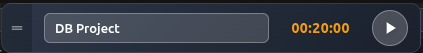

# Time Tracker

A simple desktop widget for tracking time spent on tasks, built with Electron. Built to help me keep track of what I'm working on throughout the day without having to switch between apps.



## What it does

The widget floats above your other windows and lets you start/stop a timer for different tasks. It automatically logs everything to markdown files in your Obsidian vault's Daily folder, which is pretty handy if you're already taking notes there.

Features:
- Always-on-top widget that stays out of your way
- Timer and countdown modes (great for Pomodoro)
- Logs time entries to daily markdown files
- Auto-pause after 10 minutes of inactivity (because we all forget to stop the timer)
- Keyboard shortcuts: `Ctrl+Shift+T` to toggle timer, `Ctrl+Shift+Space` to show/hide

## Running it

You'll need to have Node.js installed, then:

```bash
npm install
npm start
```

## Building

To create a distributable package:

```bash
npm run build        # builds for your platform
npm run build:linux  # specifically for Linux
```

The output will be in the `dist` folder.

## Setup

Before running, you'll want to update the vault path in `renderer.js` (line 3) to point to your own Obsidian vault:

```javascript
const vaultPath = '/path/to/your/Obsidian Vault/Daily/';
```

## License

ISC
